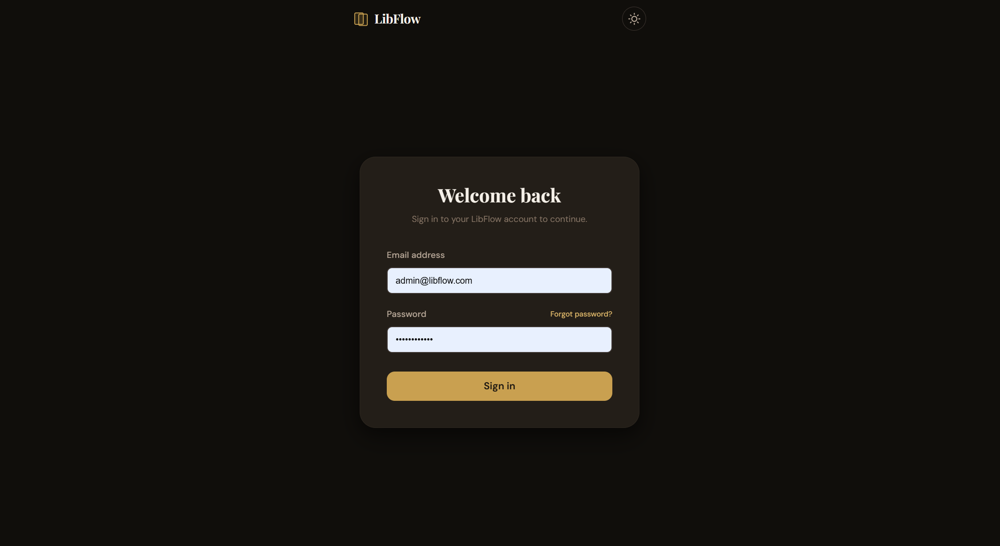
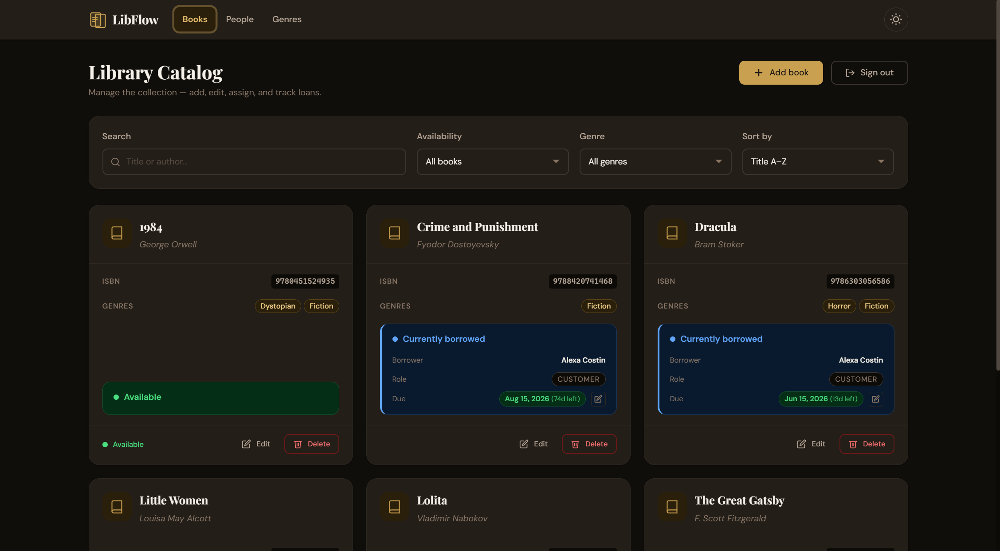
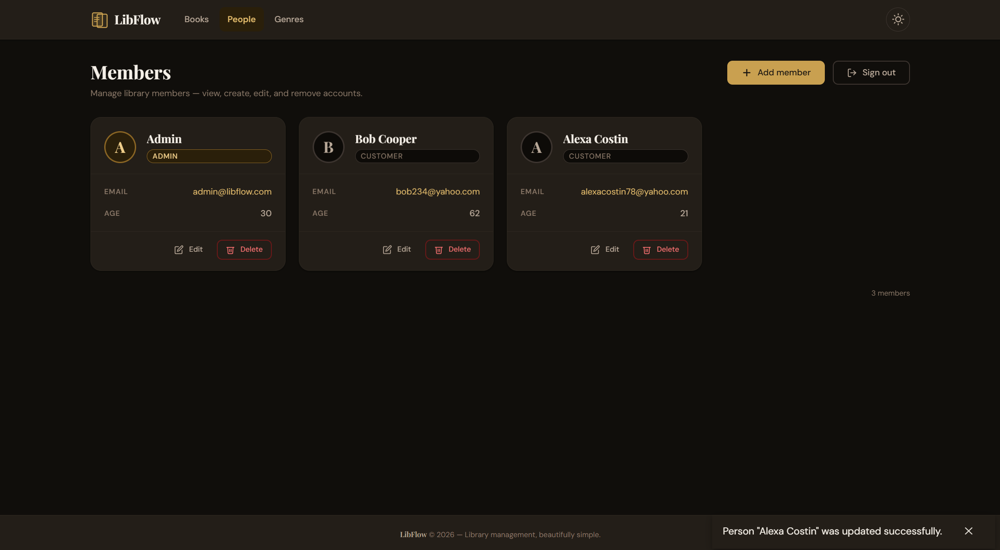

# LibFlow

LibFlow is a comprehensive library management ecosystem consisting of a modern frontend web application and a robust backend service designed to streamline the cataloging, browsing, tracking, and management of library assets.

## Project Structure

The project repository is structured as follows:

```text
LibFlow/
├── demo-app/                 # Angular Frontend Web Application
│   ├── src/
│   │   ├── app/
│   │   │   ├── components/   # Reusable UI elements (dialogs, forms)
│   │   │   └── features/     # Feature modules and views
│   │   │       ├── login/    # User Authentication Page
│   │   │       ├── book-list/# Book Management Catalog View
│   │   │       └── person-list/# Patron/User Management Directory
│   └── tests/                # Playwright End-to-End Tests
├── demo_backend/             # Spring Boot Java Backend Application
│   ├── src/
│   │   ├── main/java/com/andrei/demo/
│   │   │   ├── config/       # Security and Global Error Handling
│   │   │   ├── controller/   # REST API Endpoints (Book, Person, Auth)
│   │   │   ├── model/        # JPA Database Entities & DTOs
│   │   │   └── service/      # Business Logic & Borrowing Strategies
│   └── pom.xml               # Maven Dependency Configuration
├── Project_Vision.pdf         # Strategic overview and vision documentation
└── Project_SupplimentarySpecification.pdf # Detailed non-functional requirements
```

## Module Overview

### 1. Frontend Client (`demo-app/`)
An **Angular** web dashboard featuring reactive layouts, state management driven by dedicated stores, automated inter-module workflows, and robust interceptor-based request authentication. 

### 2. Backend API (`demo_backend/`)
A **Java Spring Boot** REST framework relying on JPA/Hibernate persistence, JSON Web Tokens (JWT) for secure authentication processing, dynamic entity validation constraints, and strategic resolution design patterns managing standard and premium user asset limitations.

---

## Screen Navigation Mapping

Below are the architectural interface routing configurations and respective design pathways for key application modules:

### User Authentication
* **Component Target:** `LoginComponent`
* **Route Configuration:** `demo-app/src/app/features/login/`
* **Visual Blueprint:**  
  

### Asset Catalog
* **Component Target:** `BookListPageComponent`
* **Route Configuration:** `demo-app/src/app/features/book-list/`
* **Visual Blueprint:**  
  

### Registry Directory
* **Component Target:** `PersonListPageComponent`
* **Route Configuration:** `demo-app/src/app/features/person-list/`
* **Visual Blueprint:**  
  

---

## Local Development Lifecycle

### Backend Server Execution
Ensure a Java 17+ environment is installed locally. Run from the directory root:
```bash
cd demo_backend
./mvnw clean spring-boot:run
```

### Frontend Client Execution
Ensure Node.js is active locally. Run from the workspace root:
```bash
cd demo-app
npm install
npm start
```
The interface mounts dynamically at `http://localhost:4200/`.
